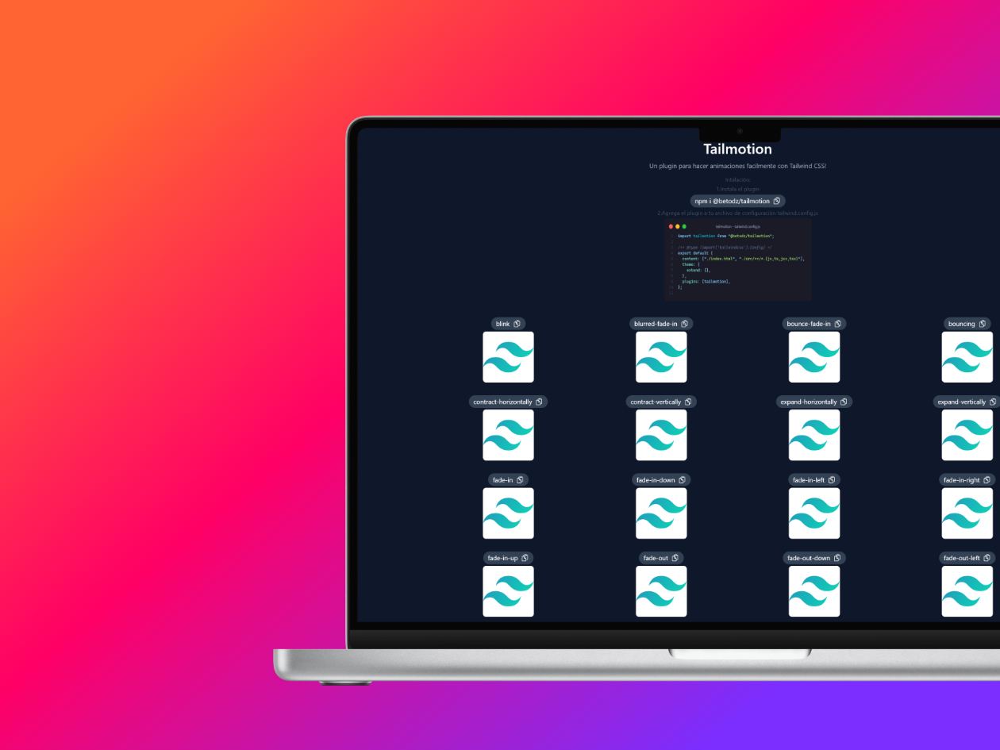
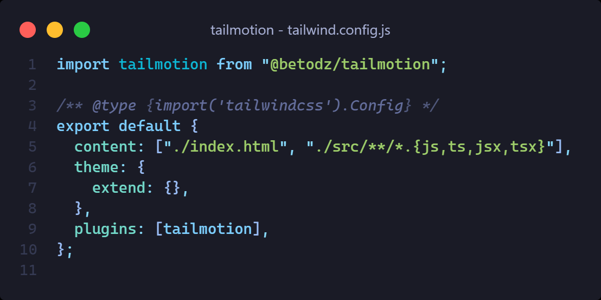
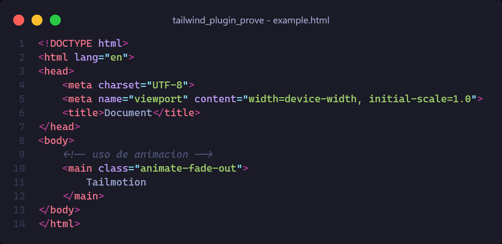

# Tailmotion

La manera más sencilla de agregar animaciones a tu web utilizando Tailwind css!



>[!IMPORTANT]
> Tailmotion solo es un plugin de tailwind, es decir, un complemento, por lo que deberías tener instalado Tailwind css en tu proyecto previamente.

Para instalar el plugin solo sigue estos sencillos pasos:
1. Instala la dependencia:
    ```
        npm i @betodz/tailmotion
    ```
2. Agrega el plugin en la configuración de tailwind



3. Utiliza las clases, puedes copiar directamente la clase desde la web y agregarla en cualquier elemento

